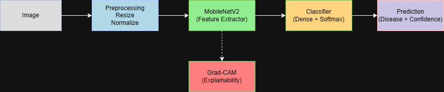
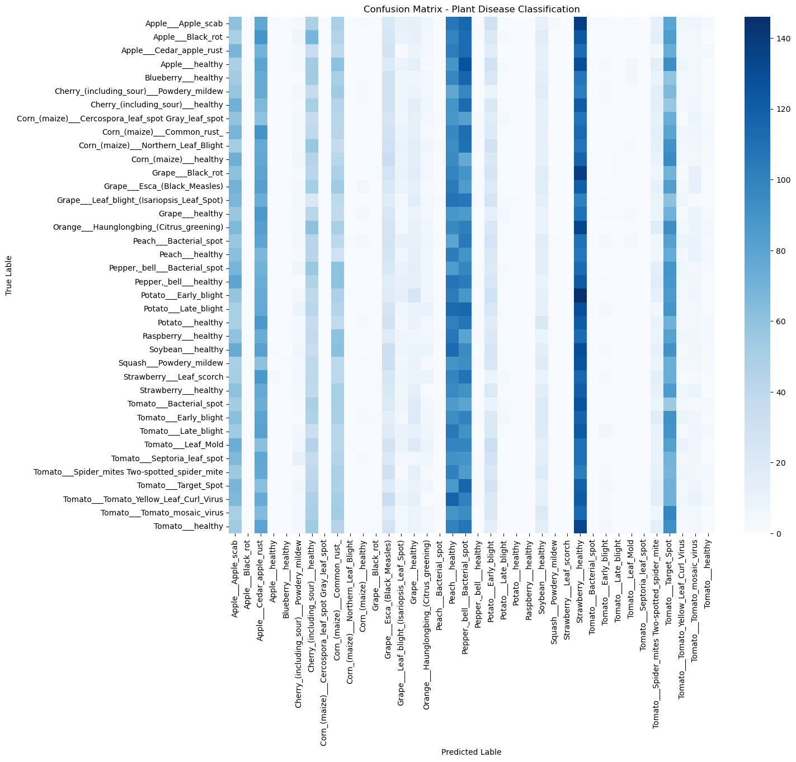
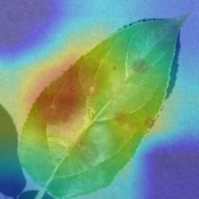

# 🌱 Plant Disease Classification using Deep Learning

## 📌 Overview
Plant diseases significantly impact agricultural productivity.
This project uses deep learning and transfer learning to classify
plant leaf images into healthy or diseased categories, with a
focus on mobile and edge deployment.

## 🎯 Problem Statement
Early detection of plant diseases can help farmers take timely
action to reduce crop loss, especially in regions with limited
access to agricultural experts.

## 📯 Impact
- Early diagnosis of crop diseases
- Reduced yield loss
- Scalable solution for rural & developing regions

---

## 📊 Dataset
- New Plant Diseases Dataset (Kaggle)
- ~1,40,000 images
- 38 plant disease classes

---

## 🧠 Approach
1. Exploratory Data Analysis (EDA)
2. Data preprocessing & augmentation
3. Baseline CNN from scratch
4. Transfer learning using MobileNetV2
5. Fine-tuning pretrained layers
6. Model evaluation & error analysis
7. Explainable AI using Grad-CAM
8. Mobile deployment with TensorFlow Lite

---

## 🏗 Model Architecture
**Base Model:** MobileNetV2 (ImageNet pretrained)  
**Custom Head:**  
- Global Average Pooling  
- Dense + Dropout  
- Softmax classifier  

---

## 🧩 System Architecture

---

## 📈 Results
- High validation accuracy across multiple disease classes
- Strong generalization on unseen data
- TensorFlow Lite model significantly reduced size

### 🔍 Confusion Matrix

### 🔬 Grad-CAM Visualization

---

## ⚙️ Model Comparison

| Model | Accuracy | Size | Deployment |
|------|--------|------|------------|
| Baseline CNN | Low | Small | ❌ |
| MobileNetV2 | High | Very Small | ✅ |
| EfficientNetB0 | Very Low | Larger | ⚠️ |

---

## 📱 Deployment
- Model converted to TensorFlow Lite
- Optimized for mobile and edge devices
- Ready for Android / IoT integration

---

## 🛠 Tech Stack
- Python
- TensorFlow / Keras
- OpenCV
- NumPy, Matplotlib, Seaborn
- TensorFlow Lite

---

## 🔮 Future Work
- Disease severity classification
- Field-condition image training
- Android application
- Multi-task learning (crop + disease)

---

## Trained Model
The trained model is available upon request.

---

## 👤 Author
**Hrishikesh Ganji**  
B.Tech CSE (Data Science)  
